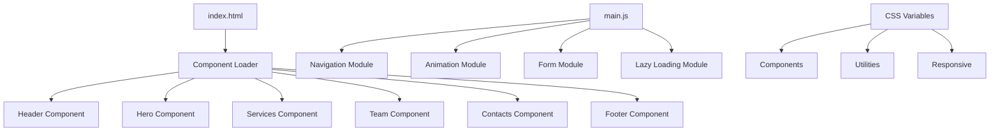

# Архитектура проекта UNevent

## Обзор

Проект построен на принципах модульной архитектуры с разделением ответственности между компонентами, стилями и логикой.

## 🏗 Структура архитектуры

### 1. Слой представления (Presentation Layer)

#### HTML-компоненты (`src/components/`)
- **header.html** — Навигация и логотип
- **hero.html** — Главная секция со слайдшоу
- **services.html** — Карточки услуг
- **team.html** — Команда
- **contacts.html** — Контакты и форма
- **footer.html** — Подвал

#### CSS-архитектура (`src/css/`)
```
css/
├── variables.css    # Дизайн-токены
├── reset.css        # Сброс стилей
├── utilities.css    # Утилитарные классы
├── components.css   # Стили компонентов
└── responsive.css   # Адаптивность
```

### 2. Слой логики (Logic Layer)

#### JavaScript-модули (`src/js/`)
- **main.js** — Точка входа, инициализация
- **navigation.js** — Навигация и мобильное меню
- **animations.js** — Анимации и Intersection Observer
- **form.js** — Валидация и отправка форм
- **lazy-loading.js** — Ленивая загрузка изображений

### 3. Слой данных (Data Layer)

#### Конфигурация
- **package.json** — Зависимости и скрипты
- **vite.config.js** — Настройки сборки
- **.eslintrc.js** — Правила линтинга
- **.prettierrc** — Форматирование кода

## 🔄 Поток данных



## 🧩 Принципы модульности

### 1. Разделение ответственности
- **HTML** — Структура и семантика
- **CSS** — Визуальное представление
- **JavaScript** — Интерактивность и логика

### 2. Компонентный подход
- Каждый компонент — отдельный файл
- Переиспользуемые стили через CSS-переменные
- Изолированная логика в JS-модулях

### 3. Принцип единственной ответственности
- Один модуль = одна функция
- Четкие интерфейсы между модулями
- Минимальные зависимости

## 🎨 Дизайн-система

### CSS-архитектура

#### 1. Переменные (variables.css)
```css
:root {
  /* Colors */
  --bg-dark: #0a0320;
  --accent-purple: #8b5cf6;
  --neon-yellow: #facc15;
  
  /* Typography */
  --font-primary: 'Space Grotesk', sans-serif;
  --font-heading: 'Satoshi', sans-serif;
  
  /* Spacing */
  --spacing-sm: 16px;
  --spacing-md: 24px;
  --spacing-lg: 32px;
  
  /* Transitions */
  --transition-fast: 0.3s ease;
  --transition-normal: 0.4s cubic-bezier(0.22, 1, 0.36, 1);
}
```

#### 2. Утилиты (utilities.css)
- Классы для быстрого применения стилей
- Адаптивные утилиты
- Анимационные классы

#### 3. Компоненты (components.css)
- Стили для конкретных компонентов
- Переиспользуемые паттерны
- Интерактивные состояния

## 🔧 JavaScript-архитектура

### Модульная система

#### 1. Главный модуль (main.js)
```javascript
class App {
  constructor() {
    this.init();
  }
  
  start() {
    this.navigation = new Navigation();
    this.animations = new AnimationController();
    this.formHandler = new FormHandler();
  }
}
```

#### 2. Специализированные модули
- **Navigation** — Управление навигацией
- **AnimationController** — Контроль анимаций
- **FormHandler** — Обработка форм
- **LazyLoader** — Ленивая загрузка

### Принципы JS-архитектуры

#### 1. Класс-ориентированный подход
- Каждый модуль — отдельный класс
- Инкапсуляция логики
- Четкие интерфейсы

#### 2. Event-driven архитектура
- Событийная модель
- Слабая связанность
- Легкое тестирование

#### 3. Асинхронность
- Intersection Observer для анимаций
- Fetch API для загрузки компонентов
- Promise-based архитектура

## 📱 Адаптивная архитектура

### Mobile-First подход

#### 1. Breakpoints
```css
/* Mobile First */
@media (min-width: 768px) { /* Tablet */ }
@media (min-width: 1024px) { /* Desktop */ }
@media (min-width: 1200px) { /* Large Desktop */ }
```

#### 2. Адаптивные компоненты
- Гибкие сетки (CSS Grid/Flexbox)
- Адаптивная типографика
- Мобильная навигация

## ⚡ Оптимизация производительности

### 1. Загрузка ресурсов
- **Критический CSS** в `<head>`
- **Ленивая загрузка** изображений
- **Preconnect** к внешним доменам

### 2. Кэширование
- **Service Worker** для офлайн-режима
- **Browser Cache** для статических ресурсов
- **CDN** для изображений

### 3. Минификация
- **CSS** и **JS** минифицируются при сборке
- **HTML** оптимизируется
- **Изображения** сжимаются

## 🔄 Сборка и развертывание

### Vite-конфигурация

#### 1. Development
```javascript
server: {
  port: 3000,
  open: true,
  host: true
}
```

#### 2. Production
```javascript
build: {
  outDir: 'dist',
  assetsDir: 'assets',
  sourcemap: true
}
```

### Процесс сборки

1. **Линтинг** — Проверка кода
2. **Компиляция** — Обработка модулей
3. **Минификация** — Сжатие ресурсов
4. **Оптимизация** — Оптимизация изображений
5. **Сборка** — Создание финальных файлов

## 🧪 Тестирование

### Стратегия тестирования

#### 1. Unit-тесты
- Тестирование отдельных модулей
- Мокирование зависимостей
- Покрытие кода

#### 2. Integration-тесты
- Тестирование взаимодействия модулей
- API-тесты
- E2E-тесты

#### 3. Performance-тесты
- Lighthouse аудит
- Core Web Vitals
- Bundle size анализ

## 📈 Мониторинг и аналитика

### Метрики производительности
- **FCP** (First Contentful Paint)
- **LCP** (Largest Contentful Paint)
- **CLS** (Cumulative Layout Shift)
- **FID** (First Input Delay)

### Аналитика
- **Google Analytics** — Поведение пользователей
- **Yandex.Metrica** — Российская аналитика
- **Hotjar** — Тепловые карты

## 🔮 Будущие улучшения

### Планируемые функции
1. **PWA** — Прогрессивное веб-приложение
2. **Dark Mode** — Темная тема
3. **Многоязычность** — i18n поддержка
4. **CMS Integration** — Интеграция с CMS
5. **Advanced Analytics** — Расширенная аналитика

### Технические улучшения
1. **TypeScript** — Типизация
2. **Web Components** — Нативные компоненты
3. **Micro-frontends** — Микрофронтенды
4. **Edge Computing** — Edge-оптимизация

---

Эта архитектура обеспечивает масштабируемость, поддерживаемость и производительность проекта UNevent.
